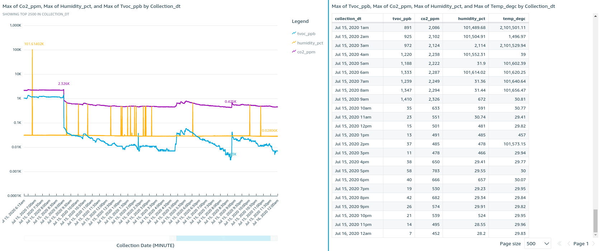
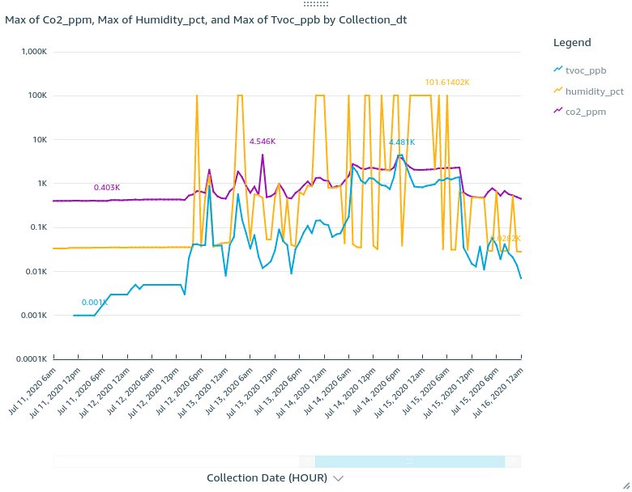
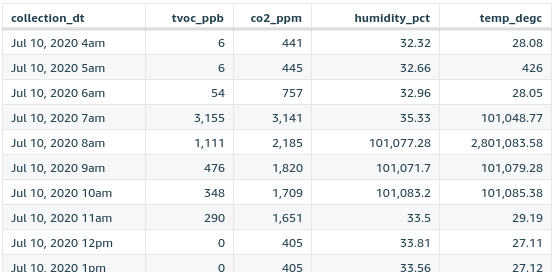

I have AWS Greengrass sending sensor data through AWS IoT to quicksight. 
I leave the sensor running 24/7 to test the environment and to establish a baseline for my tests. 
On July 15th I printed for the first time in quite a while.
The print job started at 3:30 pm and ran for ~4 hours. 

You can see a spike in TVOCs about an hour after the print started that tapers off gradually reaching a low point about an hour after the print completed. 

At this point it is inconclusive. 
If you look at a wider window of time aggregated by the hour, you can see that these levels are hardly peak or unusual. 

I also had a long running print on the 11th that seemed not to register at all on the sensors. 

The last thing to note is the noise in the sensor data. 
For some reason, occasionally the sensors report impossible values. 
For example, the humidity % has been reported as `101,077.28` which doesn't seem possible.
I suspect this is due to the inmature firmware on this dev board from sparkfun.  

